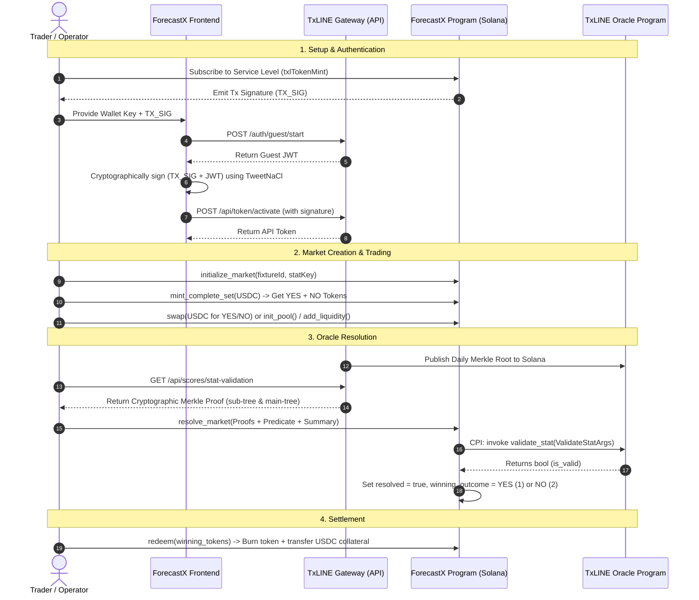

# ForecastX — Decentralized Prediction Markets for the 2026 FIFA World Cup

ForecastX is a high-performance, decentralized prediction market platform built on the Solana blockchain, specifically tailored for the 2026 FIFA World Cup. It utilizes **TxLINE** (an advanced oracle solution by TxOdds) to fetch, stream, and cryptographically verify real-time sports data on-chain.

By leveraging constant-product Automated Market Maker (AMM) pools and on-chain Merkle proof verification, ForecastX allows users to trade binary outcome shares (YES/NO) for soccer match events (e.g., *Total Goals > 0*) with guaranteed, fully collateralized payouts.

---

## Table of Contents
1. [System Architecture](#system-architecture)
2. [TxLINE Integration & API Reference](#txline-integration--api-reference)
   - [Authentication & Token Activation Flow](#authentication--token-activation-flow)
   - [REST & Stream Endpoints](#rest--stream-endpoints)
3. [Solana Smart Contract (Anchor Program)](#solana-smart-contract-anchor-program)
   - [Program Addresses](#program-addresses)
   - [PDA Derivations](#pda-derivations)
   - [Core Data Structures & Instructions](#core-data-structures--instructions)
4. [AMM & Swap Mathematical Models](#amm--swap-mathematical-models)
   - [Binary AMM Architecture](#binary-amm-architecture)
   - [Swap Equations](#swap-equations)
   - [Slippage & Fees](#slippage--fees)
5. [Developer Setup & Quickstart](#developer-setup--quickstart)

---

## System Architecture

ForecastX integrates off-chain real-time data providers with on-chain smart contract state machines. The workflow is divided into three layers:
1. **Frontend (Vite + React + TS)**: Queries the TxLINE REST/SSE feeds for match schedules, live score updates, and live bookmaker odds. Orchestrates transaction generation and executes client-side cryptographic audits of Merkle proofs.
2. **Oracle Gateway (TxLINE)**: Serves daily Merkle roots, game scores, and generates Merkle proofs for specific events (e.g., player stats, team goals).
3. **Solana Blockchain (Anchor Program)**: Manages prediction markets, token minting/burning, liquidity pools, constant-product swaps, and performs Cross-Program Invocations (CPI) to the TxLINE validator program to securely resolve markets using the oracle's Merkle proofs.

### Flow Diagram



---

## TxLINE Integration & API Reference

### Authentication & Token Activation Flow

To query the TxLINE oracle endpoints, users must register their Solana wallet and activate an API token. The multi-step cryptographic activation flow is structured as follows:

#### Step 1: Subscribe On-Chain
Call the `subscribe` instruction on the TxLINE Program on Solana, transferring TxOdds tokens (`4Zao8ocPhmMgq7PdsYWyxvqySMGx7xb9cMftPMkEokRG` on Devnet) to the program's treasury. This returns a Transaction Signature (`TX_SIG`).

#### Step 2: Initialize Guest Session
Obtain a temporary JSON Web Token (JWT):
- **Endpoint**: `POST /auth/guest/start` (on Mainnet: `https://txline.txodds.com`, Devnet: `https://txline-dev.txodds.com`)
- **Headers**: None
- **Response Payload**:
  ```json
  {
    "token": "eyJhbGciOiJFUzI1NiIsInR5cCI6IkpXVCJ9..."
  }
  ```

#### Step 3: Sign the Activation Message
Construct a message string using the template:
$$\text{messageString} = \text{TX\_SIG} + ":" + \text{selectedLeagues.join(",") } + ":" + \text{JWT}$$
*For the World Cup free tier, `selectedLeagues` is empty, simplifying the string to: `TX_SIG::JWT`.*

Compute the cryptographic signature of the UTF-8 encoded bytes of `messageString` using the user's Solana private key:
```typescript
import * as nacl from "tweetnacl";
const messageBytes = new TextEncoder().encode(messageString);
const signatureBytes = nacl.sign.detached(messageBytes, keypair.secretKey);
const walletSignature = Buffer.from(signatureBytes).toString("base64");
```

#### Step 4: Retrieve API Token
Submit the signature to the activate endpoint to retrieve the permanent API Token:
- **Endpoint**: `POST /api/token/activate`
- **Headers**: `Authorization: Bearer <GUEST_JWT>`
- **Request Body**:
  ```json
  {
    "txSig": "5GwJx9yq...",
    "walletSignature": "e1oW4...",
    "leagues": []
  }
  ```
- **Response Payload**: Returns the API Token string (`txoracle_api_...`).

---

### REST & Stream Endpoints

Once authenticated, all requests must contain the following HTTP headers:
- `Authorization: Bearer <GUEST_JWT>`
- `X-Api-Token: <API_TOKEN>`

#### 1. Fetch Fixtures Snapshot
Retrieves the list of matches.
- **Endpoint**: `GET /api/fixtures/snapshot`
- **Query Params**: `competitionId=72` (72 is the Devnet ID for FIFA World Cup)
- **Response Structure (`TxLineFixture[]`)**:
  ```typescript
  interface TxLineFixture {
    Ts: number;              // Current timestamp (ms)
    StartTime: number;       // Match kickoff epoch (ms)
    Competition: string;     // Competition name
    CompetitionId: number;   // Competition ID
    Participant1: string;    // Team 1 Name
    Participant1Id: number;  
    Participant2: string;    // Team 2 Name
    Participant2Id: number;
    FixtureId: number;       // Unique match ID
    Participant1IsHome: boolean;
  }
  ```

#### 2. Fetch Score Updates History
Retrieves historical scoring progress and events.
- **Endpoint**: `GET /api/scores/updates/{fixtureId}`
- **Response Format**: Typically returned as a stream of line-delimited Server-Sent Events (SSE) string:
  ```text
  data: {"Seq":123,"GameState":"H1","Score":{"Participant1":{"Total":{"Goals":0}},"Participant2":{"Total":{"Goals":0}}}}
  data: {"Seq":124,"Action":"game_finalised","StatusId":100,"Score":{"Participant1":{"Total":{"Goals":1}},"Participant2":{"Total":{"Goals":0}}}}
  ```

#### 3. Fetch Live Bookmaker Odds
Fetches historical and de-margined bookmaker odds updates for live-odds parity comparisons and arbitrage indicators.
- **Endpoint**: `GET /api/odds/updates/{fixtureId}`
- **Response Structure (`OddsUpdate[]`)**:
  ```typescript
  interface OddsUpdate {
    FixtureId: number;
    MessageId: string;
    Ts: number;
    Bookmaker: string;
    BookmakerId: number;
    SuperOddsType: string;   // E.g. "1X2" or "OVERUNDER"
    InRunning: boolean;
    GameState: string | null;
    PriceNames: string[];    // E.g. ["part1", "draw", "part2"] or ["over", "under"]
    Prices: number[];        // E.g. [1.95, 3.40, 4.10]
    Pct: string[];           // Implied probabilities (stringified decimals)
  }
  ```

#### 4. Stream Live Scores (SSE)
Establishes a real-time Server-Sent Events stream for immediate live updates.
- **Endpoint**: `GET /api/scores/stream?fixtureId={fixtureId}`
- **Headers**: Must include `Accept: text/event-stream`

#### 5. Get Cryptographic Stat-Validation Proofs
Returns the Merkle validation parameters required for on-chain market resolution.
- **Endpoint**: `GET /api/scores/stat-validation`
- **Query Params**:
  - `fixtureId`: The unique ID of the match.
  - `seq`: The sequence ID of the final state update (e.g. at the `game_finalised` action).
  - `statKey`: The identifier of the stat to prove (e.g. `2` for Total Goals).
- **Response Schema (`ValidateStatArgs` / Client Proof Structure)**:
  ```json
  {
    "summary": {
      "fixtureId": 18175918,
      "updateStats": {
        "updateCount": 698,
        "minTimestamp": 1785536683,
        "maxTimestamp": 1785542000
      },
      "eventStatsSubTreeRoot": "base64EncodedRoot..."
    },
    "subTreeProof": [
      { "hash": "base64Node...", "isRightSibling": true }
    ],
    "mainTreeProof": [
      { "hash": "base64Node...", "isRightSibling": false }
    ],
    "eventStatRoot": "base64DailyRoot...",
    "statProof": [
       { "hash": "base64StatNode...", "isRightSibling": true }
    ],
    "statToProve": {
      "key": 2,
      "value": 1,
      "period": 0
    }
  }
  ```

---

## Solana Smart Contract (Anchor Program)

### Program Addresses

| Layer | Component | Program ID / Public Key |
|---|---|---|
| **On-Chain Application** | ForecastX Program | `6N6ckvYjUgGZCgwoE6XCQbsMuoxjUvoT3QYUt6LbfTbi` |
| **TxLINE Oracle** | TxLINE Validator | `6pW64gN1s2uqjHkn1unFeEjAwJkPGHoppGvS715wyP2J` |
| **Collateral Asset** | Dummy USDC Mint | `y1NRCJLaggE1VGo3z3tzgut96U6UVmWLxytkjAN1aqT` |

### PDA Derivations

ForecastX relies heavily on Program Derived Addresses (PDAs) to enforce determinism and security. All keys are derived deterministically based on the `fixture_id` (64-bit unsigned integer, little-endian) and the `stat_key` (16-bit unsigned integer, little-endian).

```typescript
const fixBuf = new BN(fixtureId).toArrayLike(Buffer, 'le', 8);
const statBuf = new BN(statKey).toArrayLike(Buffer, 'le', 2);

// 1. Market PDA
const [market] = PublicKey.findProgramAddressSync([Buffer.from('market'), fixBuf, statBuf], PROGRAM_ID);

// 2. Token Mints (YES/NO Outcome Tokens)
const [yesMint] = PublicKey.findProgramAddressSync([Buffer.from('yes_mint'), market.toBuffer()], PROGRAM_ID);
const [noMint] = PublicKey.findProgramAddressSync([Buffer.from('no_mint'), market.toBuffer()], PROGRAM_ID);

// 3. USDC Collateral Vault PDA
const [vault] = PublicKey.findProgramAddressSync([Buffer.from('vault'), market.toBuffer()], PROGRAM_ID);

// 4. AMM Pool PDA
const [pool] = PublicKey.findProgramAddressSync([Buffer.from('pool'), market.toBuffer()], PROGRAM_ID);

// 5. LP Share Token Mint PDA
const [lpMint] = PublicKey.findProgramAddressSync([Buffer.from('lp_mint'), market.toBuffer()], PROGRAM_ID);

// 6. AMM Reserves (YES/NO Vaults owned by the Pool)
const [yesReserve] = PublicKey.findProgramAddressSync([Buffer.from('yes_reserve'), market.toBuffer()], PROGRAM_ID);
const [noReserve] = PublicKey.findProgramAddressSync([Buffer.from('no_reserve'), market.toBuffer()], PROGRAM_ID);
```

---

### Core Data Structures & Instructions

#### Market Struct (State Account)
```rust
#[account]
pub struct Market {
    pub fixture_id: u64,
    pub stat_key: u16,
    pub resolved: bool,
    pub winning_outcome: u8, // 0 = Unresolved, 1 = YES Wins, 2 = NO Wins
    pub authority: Pubkey,
    pub collateral_mint: Pubkey,
    pub yes_mint: Pubkey,
    pub no_mint: Pubkey,
    pub vault: Pubkey,
    pub bump: u8,
}
```

#### Pool Struct (AMM Pool Account)
```rust
#[account]
pub struct Pool {
    pub market: Pubkey,
    pub lp_mint: Pubkey,
    pub yes_reserve: Pubkey,
    pub no_reserve: Pubkey,
    pub k: u128,            // Constant product constant (x * y)
    pub bump: u8,
}
```

#### Main Smart Contract Instructions

```rust
// 1. Initialize Market
pub fn initialize_market(ctx: Context<InitializeMarket>, fixture_id: u64, stat_key: u16) -> Result<()>;

// 2. Mint Complete Set (Lock 1 USDC to mint 1 YES and 1 NO token)
pub fn mint_complete_set(ctx: Context<MintCompleteSet>, amount: u64) -> Result<()>;

// 3. Burn Complete Set (Burn 1 YES and 1 NO token to withdraw 1 USDC)
pub fn burn_complete_set(ctx: Context<BurnCompleteSet>, amount: u64) -> Result<()>;

// 4. Initialize AMM Liquidity Pool
pub fn init_pool(ctx: Context<InitPool>, initial_usdc_amount: u64) -> Result<()>;

// 5. Add / Remove Liquidity
pub fn add_liquidity(ctx: Context<AddLiquidity>, amount_usdc: u64) -> Result<()>;
pub fn remove_liquidity(ctx: Context<RemoveLiquidity>, amount_lp: u64) -> Result<()>;

// 6. Swap Tokens (Swap Type: 0 = USDC -> YES, 1 = USDC -> NO, 2 = YES -> USDC, 3 = NO -> USDC)
pub fn swap(ctx: Context<Swap>, swap_type: u8, amount_in: u64, min_amount_out: u64) -> Result<()>;

// 7. Resolve Market (Performs CPI validation against TxLINE Oracle program using Merkle proofs)
pub fn resolve_market(
    ctx: Context<ResolveMarket>,
    resolve_yes: bool,
    ts: i64,
    fixture_summary: ScoresBatchSummary,
    fixture_proof: Vec<ProofNode>,
    main_tree_proof: Vec<ProofNode>,
    predicate: TraderPredicate,
    stat_a: StatTerm,
    stat_b: Option<StatTerm>,
    op: Option<BinaryExpression>,
) -> Result<()>;

// 8. Redeem Winning Tokens (Burns winning tokens to redeem USDC 1:1)
pub fn redeem(ctx: Context<Redeem>, amount: u64) -> Result<()>;
```

---

## AMM & Swap Mathematical Models

### Binary AMM Architecture
Traditional AMMs like Uniswap v2 hold two separate assets (e.g. USDC and SOL). In binary option prediction markets, YES and NO outcome tokens are minted together 1:1 backed by USDC collateral.

The ForecastX AMM pool maintains reserves of `YES` outcome tokens ($x$) and `NO` outcome tokens ($y$), enforcing a constant product:
$$x \cdot y = k$$

Since a combined complete set ($1 \text{ YES} + 1 \text{ NO}$) is always worth exactly $1 \text{ USDC}$, the AMM manages trading by dynamically minting complete sets, separating them, and exchanging with the user.

---

### Swap Equations

#### 1. Buy YES (USDC $\rightarrow$ YES)
A user wants to buy YES tokens by paying $\Delta USDC$ (amount in).

1. The program transfers $\Delta USDC$ from the user into the collateral vault.
2. The program mints $\Delta USDC$ worth of complete sets: $\Delta USDC$ YES (given to the user) and $\Delta USDC$ NO (added to the pool's reserve).
3. The pool's NO reserve increases by $\Delta USDC$, creating an imbalance.
4. To return to the constant-product state, the pool swaps the excess NO tokens in its reserve for YES tokens, which are then transferred to the user.

$$\Delta y = \Delta USDC_{\text{fee\_adjusted}} = \Delta USDC \cdot 0.997$$

The amount of YES tokens ($\Delta x$) transferred to the user from the pool reserve is calculated as:
$$\Delta x = \frac{x \cdot \Delta y}{y + \Delta y}$$

*Total YES received by the user:*
$$\text{YES}_{\text{received}} = \Delta USDC + \Delta x$$

The new product constant is updated:
$$k_{\text{new}} = (x - \Delta x) \cdot (y + \Delta USDC)$$

---

#### 2. Buy NO (USDC $\rightarrow$ NO)
The reciprocal of the Buy YES flow.
$$\Delta x = \Delta USDC_{\text{fee\_adjusted}} = \Delta USDC \cdot 0.997$$
$$\Delta y = \frac{y \cdot \Delta x}{x + \Delta x}$$
$$\text{NO}_{\text{received}} = \Delta USDC + \Delta y$$

---

#### 3. Sell YES (YES $\rightarrow$ USDC)
To swap YES tokens back into USDC collateral without holding the matching NO tokens, the program solves a quadratic equation.

We want to sell $\Delta x_{\text{in}}$ YES tokens to extract $\Delta USDC_{\text{out}}$ from the vault. Since the vault only releases USDC by burning complete sets, the program must acquire $\Delta USDC_{\text{out}}$ NO tokens from the pool's reserve to pair with $\Delta USDC_{\text{out}}$ of the user's YES tokens, burning them on-chain.

The remaining YES tokens are sold directly into the pool reserve:
$$\text{YES sold to pool} = \Delta x_{\text{in}} - \Delta USDC_{\text{out}}$$

To find the correct withdrawal amount ($\Delta USDC_{\text{out}} = a$), the program solves:
$$a = (y - b) \cdot 0.997$$
where $b$ is the change in the pool's NO reserve.

The quadratic solver function in the smart contract resolves this via:
$$g \cdot a^2 - [x + g \cdot (y - \Delta x_{\text{in}})] \cdot a - \Delta x_{\text{in}} \cdot x = 0$$
*(where $g = 0.997$ is the fee factor).*

Using the quadratic formula:
$$a = \frac{-b + \sqrt{b^2 - 4 \cdot g \cdot c}}{2 \cdot g}$$
The result is returned as the net USDC payout to the user, and the corresponding complete sets are burned.

---

### Slippage & Fees

- **Trading Fees**: The pool enforces a **0.3%** fee on all swap swaps ($g = 0.997$), which accumulates in the pool reserves to incentivize liquidity providers.
- **Slippage Protection**: Users submit a `min_amount_out` parameter. If price impact or front-running changes the pool state such that the actual output amount is less than `min_amount_out`, the transaction reverts with `ErrorCode::SlippageExceeded`.

---

## Developer Setup & Quickstart

### Prerequisites
- NodeJS $\ge$ 18.0.0
- TS-Node & TypeScript installed globally or locally
- Solana Tool Suite (CLI)
- Rust & Anchor Framework (v0.30.1)

### Environment Configuration
Create a `.env` file in the root directory. Template:
```ini
# Environment
NETWORK=devnet
SOLANA_RPC_URL=https://api.devnet.solana.com

# Service Level settings (Free tier uses service level 1)
SERVICE_LEVEL_ID=1
DURATION_WEEKS=4

# Private Key (JSON array of numbers)
WALLET_SECRET_KEY=[129,234,184...]
DUMMY_USDC_MINT=y1NRCJLaggE1VGo3z3tzgut96U6UVmWLxytkjAN1aqT

# TxLINE Oracle credentials (generated during activation)
TX_SIG=5GwJx9yq...
GUEST_JWT=eyJ0eXAi...
API_TOKEN=txoracle_api_...
```

### Script Execution Guide
The root `package.json` contains CLI helper commands for interacting with the contracts and Oracle:

```bash
# 1. Setup/generate a new testing wallet keypair and request Sol Devnet Airdrop
npm run setup-wallet

# 2. Subscribe to the TxLINE Oracle World Cup feed
npm run subscribe-free

# 3. Create a Guest session, sign the payload, and activate the API access token
npm run activate-token

# 4. Test connection to the TxLINE Gateway API (queries competitions list)
npm run test-api

# 5. Run full integration testing suite (mints, AMM initialization, swaps, resolves market via CPI proof, redeems)
npm run test-complete-flow
```

### Running the Web Application UI
The frontend resides in the `/ui` folder. To run the interface locally:
```bash
cd ui
npm install
npm run dev
```
Open [http://localhost:5173](http://localhost:5173) in your browser. Ensure your Solana wallet extension (e.g., Phantom) is set to **Devnet**.
